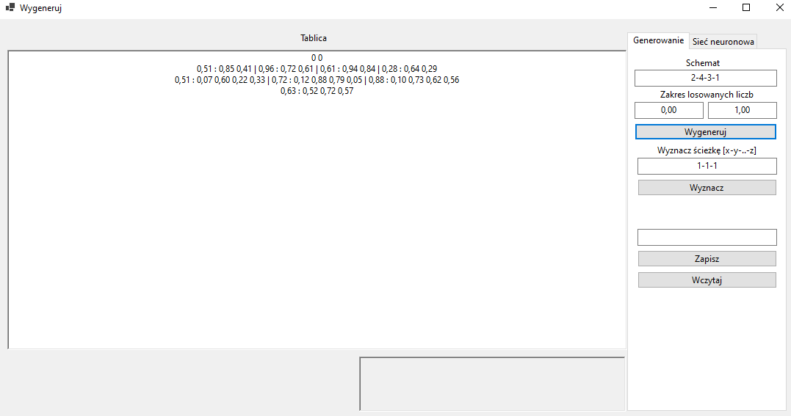
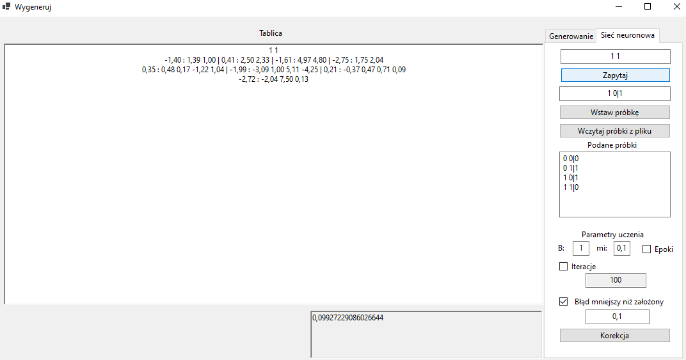

# NeuralNetwork
Application created with windows form app

 

Scheme:
x y //inputs
a : b c | d : e f // first hidden layer
g: h i

b - value on edge from input x(first input) to first hidden layer first node 
c - value on edge from input y(second input) to first hidden layer first node 
e - value on edge from input x(first input) to first hidden layer second node 
f - value on edge from input y(second input) to first hidden layer second node 
a and d - edges from cons hidden input(value = 1)
h - value on edge from previous layer first node(node with edges: a,b c) to this layer(second hidden layer) first node(only one node)
i - value on edge from previous layer first node(node with edges: d,e f) to this layer(second hidden layer) first node(only one node)
g - edge from cons hidden input(value = 1)

hidden layer symbols:
: - before symbol edge from const node (value = 1), on the right edges from outputs from previous layer
| - separates nodes

Example:
0 0 // 2 inputs
0,62 : 0,95 0,39 | 0,96 : 0,29 0,13 // hidden layer with 2 nodes
0,92 : 1,00 0,57 // hidden layer with 1 node

 
